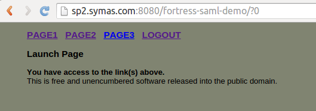

# fortress-saml-sample README

 Last updated: August 31, 2015

 This document demonstrates how to build and deploy the fortress saml sample.  It is built on top of two excellent references:
  * [spring-security-saml](https://github.com/spring-projects/spring-security-saml) - Spring's sample.
  * [shibboleth-sample-java-sp](https://github.com/UniconLabs/shibboleth-sample-java-sp) - Unicon's sample built on spring's, but showing how to hook into a Shibboleth IdP.

 Both of the above projects are the first place developers should look when wanting to understand how to use basic SAML 2.0 programming concepts.

 The **fortress-saml-sample** is a secondary step.  Taken only after the developer has mastered the saml building blocks.  This project does not provide
 an exhaustive set of use cases showing all the ways SAML can be used.  It does show how Apache Directory Fortress authorization checking can be combined with a SAML 2.0
 authentication provider.

-------------------------------------------------------------------------------
## Prerequisites
1. Java 7 (or greater) sdk
2. Git
3. Apache Maven 3
4. Completion of these steps under the [Apache Fortress Ten Minute Guide](http://directory.apache.org/fortress/gen-docs/latest/apidocs/org/apache/directory/fortress/core/doc-files/ten-minute-guide.html):
    * [Setup Apache Directory Server](http://directory.apache.org/fortress/gen-docs/latest/apidocs/org/apache/directory/fortress/core/doc-files/apache-directory-server.html)
    * [Setup Apache Directory Studio](http://directory.apache.org/fortress/gen-docs/latest/apidocs/org/apache/directory/fortress/core/doc-files/apache-directory-studio.html)
    * [Build Apache Fortress Core](http://directory.apache.org/fortress/gen-docs/latest/apidocs/org/apache/directory/fortress/core/doc-files/apache-fortress-core.html)
    * [Build Apache Fortress Realm](http://directory.apache.org/fortress/gen-docs/latest/apidocs/org/apache/directory/fortress/core/doc-files/apache-fortress-realm.html)
    * [Setup Apache Tomcat Web Server](http://directory.apache.org/fortress/gen-docs/latest/apidocs/org/apache/directory/fortress/core/doc-files/apache-tomcat.html)
    * [Build Apache Fortress Web](http://directory.apache.org/fortress/gen-docs/latest/apidocs/org/apache/directory/fortress/core/doc-files/apache-fortress-web.html)

-------------------------------------------------------------------------------
## How to generate SP metadata and register with IdP ssocircle.com

1. Complete these steps first: [SPRING-SECURITY-SAML2-SAMPLE.md](SPRING-SECURITY-SAML2-SAMPLE.md)

2. Complete these steps next: [REGISTER-SSOCIRCLE.md](REGISTER-SSOCIRCLE.md)

## How to prepare fortress saml package

1. [Download ZIP](https://github.com/shawnmckinney/fortress-saml-sample/archive/master.zip)

2. Extract the zip archive to your local machine.

3. cd fortress-saml-sample-master

4. Rename [fortress.properties.example](src/main/resources/fortress.properties.example) to fortress.properties.

 Prepare fortress for ldap server usage.

 After completing the fortress ten minute guide, this step should be familiar to you.  It is how the fortress runtime gets hooked in with a remote ldap server.
 ```properties
# This param tells fortress what type of ldap server in use:
ldap.server.type=apacheds

# Use value from [Set Hostname Entry]:
host=localhost

# if ApacheDS is listening on TLS port:
port=10389

# These credentials are used for read/write access to all nodes under suffix:
admin.user=uid=admin,ou=system
admin.pw=secret

# This is min/max settings for LDAP administrator pool connections that have read/write access to all nodes under suffix:
min.admin.conn=1
max.admin.conn=10

# This node contains fortress properties stored on behalf of connecting LDAP clients:
config.realm=DEFAULT
config.root=ou=Config,dc=example,dc=com

# Used by application security components:
perms.cached=true

# Fortress uses a cache:
ehcache.config.file=ehcache.xml
 ```

-------------------------------------------------------------------------------
## How to build and deploy

1. Set java and maven home env variables.

2. Run this command from the root package:

  Deploy to tomcat server:
  ```maven
 mvn clean tomcat:deploy -Dload.file
  ```

  Or if already deployed:
  ```maven
 mvn clean tomcat:redeploy -Dload.file
  ```

   -Dload.file tells maven to also load the wicket sample security policy into ldap.  Since the load needs to happen just once, you may drop it from future ops:
  ```maven
 mvn tomcat:redeploy
  ```
 *Note: if problem  with auto-deploy, manually deploy wicket-sample.war to webapps*

-------------------------------------------------------------------------------

## Test fortress security with spring saml sso enabled

 1. Here are the user to role assignments:
 

 2. Open link to [http://localhost:8080/fortress-saml-sample](http://localhost:8080/fortress-saml-sample)

 3. You will be rerouted to IdP.  Enter the **User Name**, **Password** values from [REGISTER-SSOCIRCLE.md](REGISTER-SSOCIRCLE.md).
 
 Click on **Continue SAML Single Sign On** button after the bot checks.

 4. If everything works, you will be redirected to the fortress-saml-sample web page.  The sam* user should see the following:
 

 5. Try a different user.
  * Map to different fortress users at [**MY Profile**](https://idp.ssocircle.com/sso/hos/SelfCare.jsp) at ssocircle.com.
  * Enter a new value for **Last Name**.
  * Use one of the preset users: sam1, sam2, sam3 or sam*.
  * click on **Submit** button to save.
  


# [ Page](src/main/javadoc/doc-files/.png "IdP Page")
# [ Page](src/main/javadoc/doc-files/.png "IdP Page")


 5. That user, sam* has access to all pages/buttons.


 7. Delete the cookies from browser for IdP and SP websites.

 8. Hit the home page again, login with IdP using same creds entered in step above.

 9. Each user mapped to **Last Name** field in SSOCircle.com has a slightly different access policy.
  * sam1 - access to page one
  * sam2 - access to page two
  * sam3 - access to page three
  * sam* - access to all pages

 10. Screen shots:
  * sam*
    

  * sam1
    

  * sam2
    

  * sam3
    