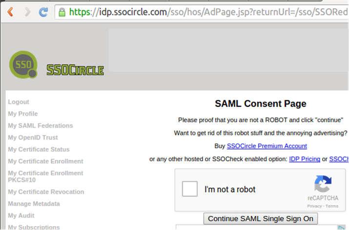

# Overview of the fortress-saml-demo README

 * This document demonstrates how to build and deploy the fortress saml sample.
 * It builds on two excellent references:
  * [spring-security-saml](https://github.com/spring-projects/spring-security-saml) - Spring's SAML sample is the first place java developers should look for basic SAML 2.0 programming concepts..
  * [shibboleth-sample-java-sp](https://github.com/UniconLabs/shibboleth-sample-java-sp) - Unicon's sample is where ones goes to understand how to combine Spring SAML with Shibboleth IdP.
 * This sample is a third step.  It shows how to hook Apache Directory Fortress in with a common Identity Provider which provides SSO as-a-service.  This allows us to
 bypass the complexities of a full IdP setup in order to focus on the Service Provider side.
 * This project was not meant to illustrate the various SAML 2.0 use cases.  It does show how Apache Directory Fortress can be combined with a simple SAML use case and Spring Security.
 * Here we use the Apache Wicket web framework. To learn the details of combining Apache Wicket and Fortress, check out:
 [wicket-sample](https://github.com/shawnmckinney/wicket-sample)

-------------------------------------------------------------------------------
## fortress-sample-demo prerequisites
1. Java 7 (or greater) sdk
2. Git
3. Apache Maven 3
4. Completion of these steps under the [Apache Fortress Ten Minute Guide](http://directory.apache.org/fortress/gen-docs/latest/apidocs/org/apache/directory/fortress/core/doc-files/ten-minute-guide.html):
    * [Setup Apache Directory Server](http://directory.apache.org/fortress/gen-docs/latest/apidocs/org/apache/directory/fortress/core/doc-files/apache-directory-server.html)
    * [Setup Apache Directory Studio](http://directory.apache.org/fortress/gen-docs/latest/apidocs/org/apache/directory/fortress/core/doc-files/apache-directory-studio.html)
    * [Build Apache Fortress Core](http://directory.apache.org/fortress/gen-docs/latest/apidocs/org/apache/directory/fortress/core/doc-files/apache-fortress-core.html)
    * [Build Apache Fortress Realm](http://directory.apache.org/fortress/gen-docs/latest/apidocs/org/apache/directory/fortress/core/doc-files/apache-fortress-realm.html)
    * [Setup Apache Tomcat Web Server](http://directory.apache.org/fortress/gen-docs/latest/apidocs/org/apache/directory/fortress/core/doc-files/apache-tomcat.html)
    * [Build Apache Fortress Web](http://directory.apache.org/fortress/gen-docs/latest/apidocs/org/apache/directory/fortress/core/doc-files/apache-fortress-web.html)

-------------------------------------------------------------------------------
## Generate SP metadata and register with IdP ssocircle.com

1. Complete these steps first: [SPRING-SECURITY-SAML2-SAMPLE.md](SPRING-SECURITY-SAML2-SAMPLE.md)

2. Complete these steps next: [REGISTER-SSOCIRCLE.md](REGISTER-SSOCIRCLE.md)

## Prepare fortress-saml-demo package

1. [Download ZIP](https://github.com/shawnmckinney/fortress-saml-demo/archive/master.zip)


2. Extract the zip archive to your local machine.

3. cd fortress-saml-demo-master

4. Rename [fortress.properties.example](src/main/resources/fortress.properties.example) to fortress.properties.

 Prepare fortress for ldap server usage.

 After completing the fortress ten minute guide, this step should be familiar to you.  It is how the fortress runtime gets hooked in with a remote ldap server.
 ```properties
# This param tells fortress what type of ldap server in use:
ldap.server.type=apacheds

# Use value from [Set Hostname Entry]:
host=localhost

# if ApacheDS is listening on TLS port:
port=10389

# These credentials are used for read/write access to all nodes under suffix:
admin.user=uid=admin,ou=system
admin.pw=secret

# This is min/max settings for LDAP administrator pool connections that have read/write access to all nodes under suffix:
min.admin.conn=1
max.admin.conn=10

# This node contains fortress properties stored on behalf of connecting LDAP clients:
config.realm=DEFAULT
config.root=ou=Config,dc=example,dc=com

# Used by application security components:
perms.cached=true

# Fortress uses a cache:
ehcache.config.file=ehcache.xml
 ```

-------------------------------------------------------------------------------
## Build and deploy fortress-saml-demo

1. Set java and maven home env variables.

2. Run this command from the root package:

  Deploy to tomcat server:
  ```maven
 mvn clean tomcat:deploy -Dload.file
  ```

  Or if already deployed:
  ```maven
 mvn clean tomcat:redeploy -Dload.file
  ```

   -Dload.file tells maven to also load the wicket sample security policy into ldap.  Since the load needs to happen just once, you may drop it from future ops:
  ```maven
 mvn tomcat:redeploy
  ```
 *Note: if problem  with auto-deploy, manually deploy wicket-sample.war to webapps*

-------------------------------------------------------------------------------

## Test fortress security with spring saml sso enabled

 To get understanding of security policy, check out .

 1. Open link to [http://localhost:8080/fortress-saml-demo](http://localhost:8080/fortress-saml-demo)

 2. You will be redirected to the Identity Provider's website.  Enter the **User Name**, **Password** values from the [REGISTER-SSOCIRCLE.md](REGISTER-SSOCIRCLE.md) steps.
 

 3. Click on the **I'm not a robot** checkbox and answer the questions and click on the **Continue SAML Single Sign On** button.
 

 4. If everything works during login to IdP you'll be redirected back to the fortress-saml-sample web page.  The user, sam*, has all links enabled:
 

 5. Try a different user...
  * Map to different fortress users at [**MY Profile**](https://idp.ssocircle.com/sso/hos/SelfCare.jsp) page on ssocircle.com.
  * Enter a new **Surname**.
  * Pick from one of these: sam1, sam2, sam3 or sam*.
  * Be sure to enter the original IdP password in **Old password** field before clicking on the **Submit** button to save your changes.
  
  * Delete the cookies from browser corresponding with the IdP and SP websites.
  * Now, go back to Step 1 and login again.  Will be different authorizations corresponding with other userIds mapped.
  

 6. Each fortress userId (mapped to **Last Name** field at IdP) has different access policy.
  * sam1 - access to page one
  * sam2 - access to page two
  * sam3 - access to page three
  * sam* - access to all pages